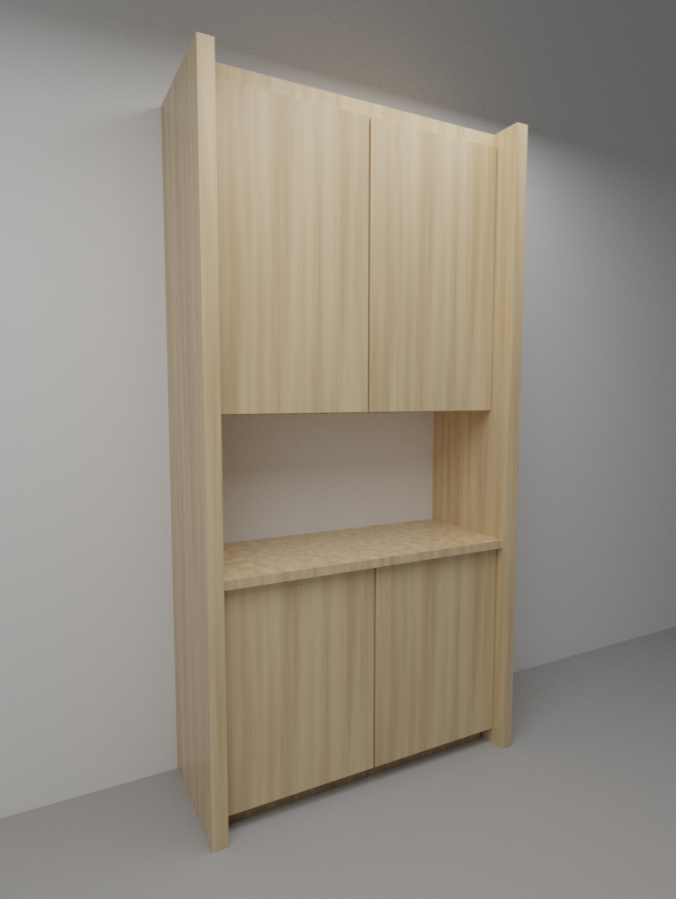

# Blender MCP 接続 基本仕様

ローカル PC の Blender を Claude Code から操作するための構成と手順。

## 構成

```
ローカル PC
┌─────────────────────────────────────────────┐
│  Blender (GUI)                              │
│   └ アドオン "Interface: MCP for Blender"   │
│        ↑ ソケット通信 (localhost)           │
│  blender-mcp (MCP サーバ / uvx で起動)      │
│        ↑ stdio                              │
│  Claude Code (ターミナルで起動)             │
└─────────────────────────────────────────────┘
```

すべて 1 台の PC 上で完結する。クラウド実行環境（Claude Code on the web）は
この構成に含まれない。クラウド側のコンテナからローカルの Blender には到達できないため、
クラウドセッションでできるのは Blender 用スクリプトの作成までとなる。

## 前提条件

| 項目 | 要件 |
| --- | --- |
| Blender | 3.0 以降（GUI 版） |
| Python | 3.10 以降 |
| uv | 必須。公式インストーラで導入すること（`pip install uv` は不可） |
| Claude Code | ターミナル版。Claude サブスクリプションまたは Console アカウント |

## セットアップ（初回のみ）

### 1. uv を導入

```bash
# macOS
brew install uv

# Linux
curl -LsSf https://astral.sh/uv/install.sh | sh

# Windows PowerShell
powershell -c "irm https://astral.sh/uv/install.ps1 | iex"
```

Windows では導入後に uv をユーザー PATH へ追加する。

### 2. MCP サーバを登録

```bash
claude mcp add --scope user blender -- uvx blender-mcp
```

`--` の後ろが実際に起動されるコマンド。`--` より前は Claude Code のオプション。

スコープの選択肢:

| スコープ | 保存先 | 有効範囲 | チーム共有 |
| --- | --- | --- | --- |
| `local`（既定） | `~/.claude.json` | そのプロジェクトのみ | されない |
| `project` | プロジェクト直下の `.mcp.json` | そのプロジェクトのみ | される（git 管理） |
| `user` | `~/.claude.json` | 全プロジェクト | されない |

Blender はどの作業ディレクトリからでも使いたいため `user` を既定とする。

### 3. Blender アドオンを配置

```bash
uvx blender-mcp install-addon
```

Blender を起動し **Edit → Preferences → Add-ons** で `MCP for Blender` を検索して有効化する。

## 毎回の起動手順

1. Blender を起動し、3D ビューポートで `N` キーを押してサイドバーを開く
2. **MCP for Blender** タブを選択し、使用する機能のチェックボックスをオンにする
3. **Start MCP Server** をクリックする
4. 別のターミナルで作業ディレクトリへ移動し `claude` を起動する
5. `/mcp` を実行し `blender` が **connected** であることを確認する

順序が重要。**Blender 側のサーバを先に起動**してから Claude Code を起動する。

## 利用できる機能

- シーン情報の取得、オブジェクトの操作
- マテリアルの作成・編集
- Blender 内での Python 実行
- Poly Haven / Sketchfab / Poly Pizza からのアセット取得
- Hyper3D Rodin / Hunyuan3D による AI 3D モデル生成

## 運用上の注意

- **MCP サーバのインスタンスは常に 1 つだけ**にする。Claude Desktop・Cursor・Claude Code から同時に接続しない
- `execute_blender_code` は Blender 内で任意の Python を実行する。**作業前に必ず .blend を保存**すること
- MCP サーバはセッション開始時に読み込まれる。設定を変更したら Claude Code を再起動する

## トラブルシューティング

| 症状 | 対処 |
| --- | --- |
| `uvx` が見つからない | `which uvx`（Windows は `where uvx`）でフルパスを確認し、`claude mcp add --scope user blender -- /full/path/uvx blender-mcp` で登録し直す |
| `/mcp` に blender が出ない | `claude mcp list` で登録を確認し、Claude Code を再起動する |
| connected だが操作できない | Blender 側で **Start MCP Server** を押し忘れていないか確認する |
| 登録を削除したい | `claude mcp remove --scope user blender` |

## ヘッドレス環境（Linux / GUI なし）で構築する場合

基本仕様は GUI 版 Blender を前提としている。CI やコンテナなど画面のない環境で
同じ構成を組む場合は、以下の差分がある。**GUI 環境では起きない問題なので、
通常のセットアップでは読み飛ばしてよい。**

### 起動方法

GUI の **Start MCP Server** ボタンに相当する処理をスクリプト化し、仮想ディスプレイ上で
Blender を常駐させる。バックグラウンドモード（`-b`）ではイベントループが回らず
サーバが待ち受けないため、`xvfb-run` を使う。

```python
# start_mcp.py
import bpy

def start():
    bpy.ops.preferences.addon_enable(module="blender_mcp")
    bpy.ops.blendermcp.start_server()
    print("SERVER_RUNNING:", bpy.context.scene.blendermcp_server_running)
    return None

bpy.app.timers.register(start, first_interval=3.0)
```

```bash
export LIBGL_ALWAYS_SOFTWARE=1
xvfb-run -a --server-args="-screen 0 1920x1080x24" blender --python start_mcp.py
```

### つまずいた点

| 症状 | 原因 | 対処 |
| --- | --- | --- |
| `install-addon` が「アドオンディレクトリが見つからない」で失敗 | Blender を一度も起動していないとディレクトリが作られない | ディレクトリを作り `BLENDERMCP_ADDONS_DIR` で明示する |
| アドオン有効化時に `ModuleNotFoundError: requests` | apt 版 Blender はシステム Python を使うが `requests` が未導入 | `apt-get install -y python3-requests` |
| `get_viewport_screenshot` が真っ黒な画像を返す | ソフトウェア OpenGL では GL バッファの読み出しが効かない | ビューポートを諦め、`bpy.ops.render.render(write_still=True)` で実レンダリングして確認する |
| レンダリングが `Error: Build without OpenImageDenoiser` で失敗 | Ubuntu 版 Blender はデノイザ非搭載ビルド | `scene.cycles.use_denoising = False`。ノイズはサンプル数で潰す |
| `python3` で入れたはずのモジュールが読めない | `python3` が 3.11 を指す一方、apt パッケージは 3.12 向けだった | `/usr/bin/python3.12` のようにインタプリタを明示する |

### スクリプトを書くときの注意

- **シェーダーノードは名前ではなく `type` で引く。** UI 言語が日本語だと
  `nodes["プリンシプルBSDF"]` になり、英語名では取得できない
  （`next(n for n in mat.node_tree.nodes if n.type == "BSDF_PRINCIPLED")`）
- **`scene.render.engine` は RNA が選択肢を過小申告する。** 代入して `TypeError` を
  捕まえるのが確実。`view_settings.view_transform` も同様
- **長いレンダリングは MCP の 60 秒タイムアウトを超える。** ツール呼び出しは失敗するが
  Blender 側の処理は続くので、出力ファイルの生成を待って確認する

## 生成例

`scripts/blender/genkan_cabinet.py` を実行して出力したパース。



## 参考

- blender-mcp: https://github.com/ahujasid/blender-mcp
- Claude Code MCP ドキュメント: https://code.claude.com/docs/en/mcp
- Claude Code クイックスタート: https://code.claude.com/docs/en/quickstart
