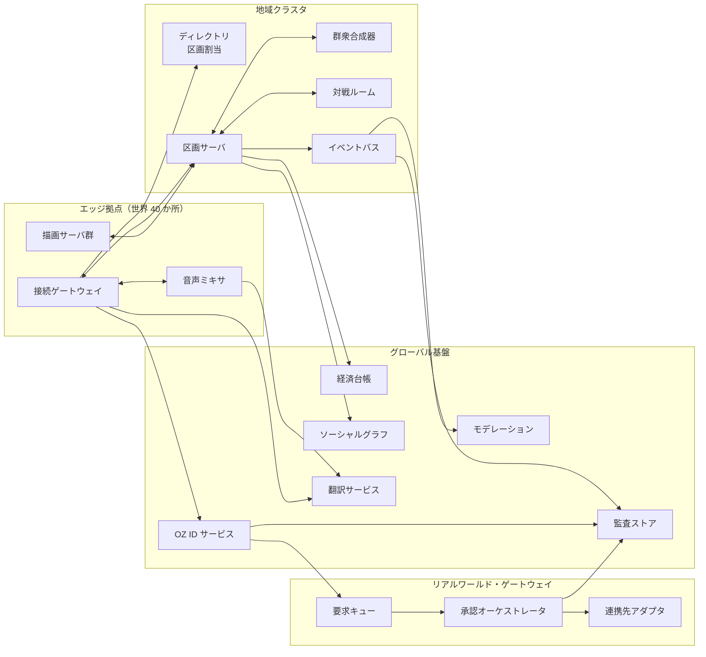
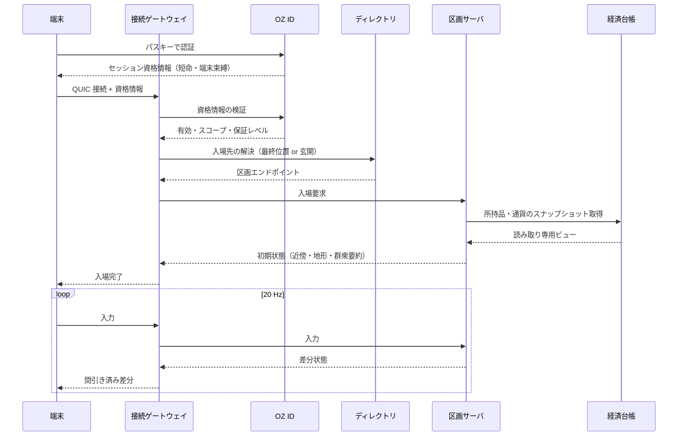

# 02. アーキテクチャ

---

## 1. 層構成と責務

| 層 | 責務 | 状態の持ち方 | 障害時の影響 |
| --- | --- | --- | --- |
| ① 端末 | 入力取得、描画、予測、原音声の取得 | 揮発 | 当該利用者のみ |
| ② エッジ | 接続終端、暗号、間引き、クラウド描画 | 接続状態のみ | 再接続で別エッジへ |
| ③ シミュレーション | 空間の権威状態、物理、関心管理 | 権威（揮発＋定期永続化） | 当該区画のみ |
| ④ プラットフォーム | ID、経済、社会関係、翻訳、審査 | 永続（強一貫） | 機能単位で縮退 |
| ⑤ ゲートウェイ | 現実への要求の受付・承認・転送 | 永続（監査付） | 連携先単位で停止 |
| ⑥ 現実側 | 実際の業務処理 | 各事業者 | OZ から独立 |

原則として **下の層は上の層を呼ばない**。
④ が ③ に通知を届ける必要がある場合は、イベントバス経由の非同期配信のみを使います。

---

## 2. コンポーネント構成



### 2.1 主要コンポーネントの役割

**接続ゲートウェイ** — 端末との唯一の接続点。QUIC の接続を終端し、
OZ ID のセッション資格情報を検証し、区画サーバへのルーティングを行う。
ここで帯域に応じた間引きと優先度制御を行うため、上流は端末能力を意識しない。

**ディレクトリ** — 座標・イベント ID から担当区画サーバを解決する。
区画の分割・統合・移設を管理し、利用者から見た連続性を保つ。

**区画サーバ** — 空間の権威。物理演算、衝突、所持品の授受、入退場を処理する。
1 プロセスが 1 区画を担当し、隣接区画とは境界のみを交換する。

**群衆合成器** — 権威管理の対象外にある大量のアバターを、
統計量（密度、流向、平均色、発話量）として配信可能な形に圧縮する。

**対戦ルーム** — 競技のように厳密な公平性が要る場面で、
区画サーバから切り離した決定論的シミュレーションを行う。

**OZ ID サービス** — 認証、資格情報の発行、接続先の管理、失効。
詳細は [03 章](03-identity.md)。

**経済台帳** — 通貨と所持品の唯一の真実。空間状態とは独立して永続する。

**翻訳サービス** — 音声認識、翻訳、音声合成の段構成。詳細は [05 章](05-network-client.md)。

**監査ストア** — 追記のみ。ハッシュ連鎖と外部への定期アンカリングにより、
内部の特権者でも過去の改変ができない構造にする。

---

## 3. 入場のデータフロー



入場時に経済台帳から取るのは読み取り専用のビューです。
区画サーバは所持品の増減を自分では確定させず、
授受の確定は常に台帳側のトランザクションで行います。
区画サーバが侵害されても、通貨が湧くことはありません。

---

## 4. 状態の分類

| 種別 | 例 | 権威 | 一貫性 | 消失時 |
| --- | --- | --- | --- | --- |
| 身体状態 | 位置、姿勢、表情 | 区画サーバ | 近傍のみ厳密 | 再入場で復元 |
| 空間状態 | 設置物、扉、掲示 | 区画サーバ＋定期永続 | 区画内で厳密 | 直近チェックポイントへ |
| 資産 | 通貨、所持品、権利証 | 経済台帳 | 強一貫 | 消失させない |
| 関係 | 友人、所属、信用 | ソーシャルグラフ | 結果整合 | 再構築可能 |
| 同一性 | 鍵、資格情報 | OZ ID | 強一貫 | 回復手続 |
| 記録 | 監査、要求履歴 | 監査ストア | 追記のみ | 消失させない |

**資産・同一性・記録の三つは、仮想空間が全部落ちても生き残る**ように
別系統で永続化します。空間は再構築できますが、この三つは再構築できません。

---

## 5. 主要インターフェース

境界をまたぐ通信はすべてスキーマ定義を持ちます。以下は抜粋です。

### 5.1 端末 ⇄ 区画サーバ（バイナリ・QUIC datagram）

```protobuf
message ClientInput {
  uint32 seq        = 1;  // 予測・照合用の連番
  uint32 tick       = 2;  // 端末が想定するサーバ tick
  sfixed32 move_x   = 3;  // 量子化済み入力ベクトル
  sfixed32 move_y   = 4;
  uint32 look_yaw   = 5;  // 16 bit 量子化
  uint32 look_pitch = 6;
  uint32 actions    = 7;  // ビットフラグ
}

message WorldDelta {
  uint32 tick              = 1;
  uint32 ack_input_seq     = 2;
  repeated AvatarDelta near = 3;  // 個体として厳密
  CrowdSummary crowd        = 4;  // 統計的
  repeated WorldEvent events = 5;
}
```

### 5.2 区画サーバ ⇄ 経済台帳（gRPC）

```protobuf
service Ledger {
  rpc OpenView(OpenViewRequest) returns (LedgerView);          // 読み取り専用
  rpc ProposeTransfer(TransferProposal) returns (TransferTicket); // 提案のみ
  rpc CommitTransfer(TransferTicket) returns (TransferResult);  // 二相確定
}
```

区画サーバは `ProposeTransfer` までしか単独では実行できず、
確定には双方の端末が署名した受領確認が必要です。

### 5.3 プラットフォーム ⇄ ゲートウェイ（HTTPS + mTLS）

```protobuf
message RealWorldRequest {
  string request_id    = 1;
  string subject_did   = 2;  // 要求者の分散型識別子
  string capability    = 3;  // 例: "gov.residence_certificate.issue"
  bytes  payload       = 4;  // 連携先定義のスキーマ
  uint32 risk_tier     = 5;  // 1〜4
  bytes  subject_proof = 6;  // 利用者端末の署名
}
```

`risk_tier` が承認方式と最低滞留時間を決めます。詳細は [06 章](06-real-world-gateway.md)。

---

## 6. 配置

| 種別 | 配置 | 台数目安（第 4 段階） |
| --- | --- | --- |
| エッジ拠点 | 主要都市圏 40 か所 | 拠点あたり 200〜600 台 |
| 地域クラスタ | 大陸単位 8 か所 | クラスタあたり 3,000〜6,000 台 |
| グローバル基盤 | 3 地域に多重化 | 合計 2,000 台 |
| ゲートウェイ | 連携先の国・分野ごとに分離 | 分野あたり 20 台 |
| 監査ストア | 独立した運用主体 | 500 台 |

ゲートウェイと監査ストアは、**空間側とは別の運用組織・別の権限系統**に置きます。
同じ運用者が両方の鍵を持つ構成は、内部犯行と誤操作の双方に対して脆弱です。
