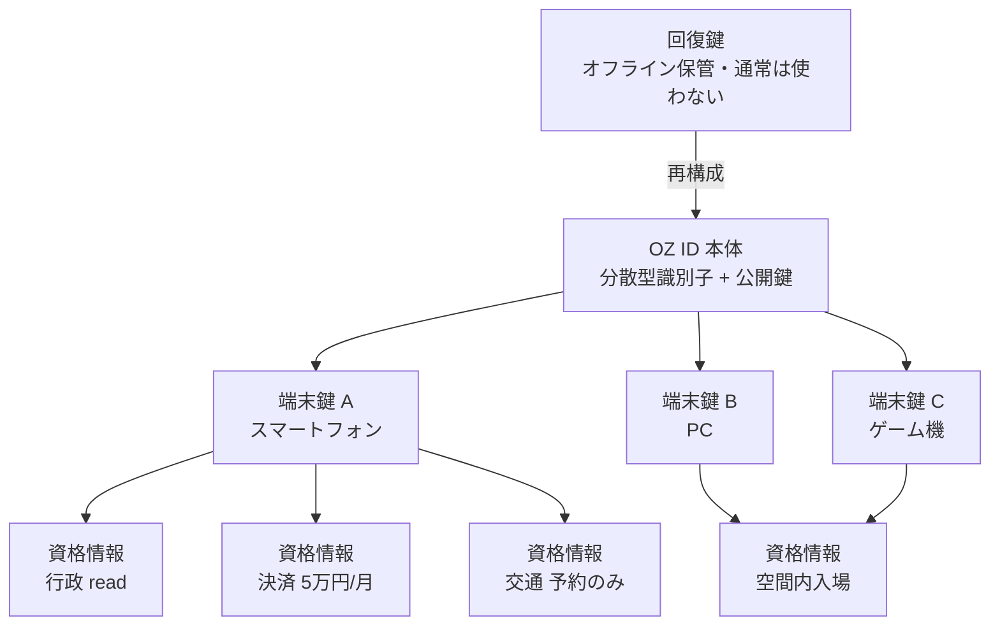

# 03. アイデンティティ（OZ ID）

OZ の便利さの源泉であり、同時に作中の事故の入口でもあった部分です。
「ひとつの ID で全部につながる」体験を保ちながら、
「ひとつ破られたら全部が落ちる」性質だけを取り除くことがこの章の目的です。

---

## 1. 基本構造

OZ ID は、事業者のデータベース上の行ではなく、**利用者が保持する鍵の集合**です。



| 要素 | 実体 | 保管場所 | 失効の影響 |
| --- | --- | --- | --- |
| 回復鍵 | 秘密分散された鍵片 | 利用者・信頼者・保管事業者に分散 | ID 全体の再構成に必要 |
| ID 本体 | 分散型識別子（DID）と公開鍵 | 公開レジストリ | — |
| 端末鍵 | 端末のセキュア領域内の鍵（FIDO2 / パスキー） | 端末から取り出せない | その端末のみ利用不可 |
| 資格情報 | 用途と上限を含む短命の署名付きトークン | メモリ上のみ | その用途のみ利用不可 |

端末鍵は **エクスポート不可能** であることを必須とします。
これにより、サーバ側が全面的に侵害されても、攻撃者は利用者になりすませません。
サーバが持っているのは公開鍵だけだからです。

---

## 2. 認証

### 2.1 保証レベル

| レベル | 手段 | 許可される操作 |
| --- | --- | --- |
| AL1 | 端末鍵のみ | 入場、会話、閲覧 |
| AL2 | 端末鍵 + 生体または PIN | 少額決済、所持品授受、予約 |
| AL3 | AL2 + 別端末での確認 | 高額決済、個人情報の開示、連携先の追加 |
| AL4 | AL3 + 帯域外承認（本人確認済の別経路） | 重要分野の要求、ID 設定の変更 |

保証レベルは**操作ごとに要求され、セッション全体には昇格しません**。
一度 AL4 を通したからといって、以後の操作が AL4 のまま扱われることはありません。
これは作中で描かれた「管理者権限を奪えば何でもできる」状態を成立させないための措置です。

### 2.2 セッション資格情報

- 有効期間 10 分、端末鍵に束縛（トークン単体では再利用できない）。
- 発行時にスコープ、地域、端末の特徴量を埋め込む。
- ネットワーク経路の急変、端末特徴量の不一致を検知したら即時失効。

---

## 3. 認可

### 3.1 用途別資格情報

サービス連携は ID 本体ではなく、用途ごとの資格情報で行います。

```json
{
  "iss": "did:oz:issuer:jp-gov-bridge",
  "sub": "did:oz:user:8f2c...",
  "cap": "gov.residence_certificate.issue",
  "constraints": {
    "max_per_day": 3,
    "requires_assurance": "AL3",
    "valid_until": "2026-09-13T12:40:00Z",
    "audience": "rwg.jp.municipal"
  },
  "proof": { "type": "Ed25519Signature2020", "...": "..." }
}
```

制約の評価はゲートウェイ側で行い、**発行側の主張を検証なしに信用しません**。

### 3.2 権限の粒度

| 分野 | 与える権限 | 与えない権限 |
| --- | --- | --- |
| 行政 | 証明書の交付申請、申請状況の閲覧 | 住民記録の書き換え |
| 金融 | 上限付き支払い、残高閲覧 | 口座の開設・解約、限度額の変更 |
| 交通 | 予約、経路照会、遅延通知 | 運行制御、信号制御 |
| 医療 | 予約、本人分の記録閲覧 | 処方の変更、他者記録の閲覧 |
| 物流 | 配送状況の閲覧、受取変更 | 配送計画の書き換え |
| インフラ | 障害情報の閲覧のみ | いかなる制御も不可 |

「与えない権限」の列が本設計の骨格です。
**便利さのために右列を左列へ移す判断は、技術的判断ではなく社会的判断**として扱い、
[07 章](07-security-governance.md) のガバナンス手続を経なければ変更できません。

---

## 4. アカウント保護

### 4.1 想定する攻撃と対策

| 攻撃 | 作中の対応物 | 対策 |
| --- | --- | --- |
| 認証情報の窃取 | 暗号を解かせて鍵を得る | 端末鍵は取り出せない。窃取対象が存在しない |
| 総当たり・解読 | 数学的に鍵を破る | 鍵導出を端末セキュア領域に閉じる。試行はレート制限と端末単位で遮断 |
| なりすまし入場 | 他人のアバターとして振る舞う | 資格情報は端末束縛。移し替えは失効を伴う |
| 権限昇格 | 管理者権限の奪取 | 特権は単独で成立しない（§5） |
| 大量アカウント奪取 | 数百万アカウントの掌握 | 異常検知＋自動遮断（§4.2） |
| 内部犯行 | — | 特権の分割、監査の独立運用 |

### 4.2 大量奪取の検知と遮断

作中の被害は「一件ずつの乗っ取り」ではなく「速度」によって成立しました。
したがって検知も速度に対して行います。

| 指標 | しきい値（例） | 自動処置 |
| --- | --- | --- |
| 新規端末登録レート | 平常比 5 倍 | 新規登録を全域で保留 |
| 同一地域からの資格情報発行失敗 | 平常比 10 倍 | 当該地域の発行を停止 |
| 資格情報の異常な用途分布 | 統計的外れ値 | 該当用途を全域で停止 |
| 高リスク要求の急増 | 1 分で平常比 3 倍 | ゲートウェイを自動で閉じる |

自動処置は**利用者を締め出す方向にのみ**働きます。
自動で緩む処置は作らない、というのが原則です。

### 4.3 回復

端末をすべて失った場合の回復手続：

1. 回復鍵の鍵片を、しきい値（例：5 分割のうち 3 片）だけ集める。
2. 鍵片の保持者は、利用者本人・信頼する人物・保管事業者に分散させる。
3. 集めた鍵片で新しい端末鍵を登録する。
4. 登録から **72 時間の待機期間** を置き、その間は AL1 相当の操作のみ許可する。
5. 待機期間中、旧端末が生きていれば通知が届き、回復を取り消せる。

待機期間は不便ですが、回復手続は攻撃者にとって最も魅力的な入口であり、
ここだけは速度を犠牲にします。

---

## 5. 特権操作

管理者という単一の役職を置きません。特権は種類ごとに分け、
それぞれ異なる人物・異なる鍵・異なる承認要件を持ちます。

| 特権 | 承認要件 | 最大有効時間 | 遡及監査 |
| --- | --- | --- | --- |
| 区画の強制停止 | 2 名 | 1 時間 | 24 時間以内に報告 |
| アカウントの緊急凍結 | 2 名 | 24 時間 | 週次レビュー |
| 資格情報の一括失効 | 3 名（うち 1 名は運用外の役員） | 6 時間 | 即時公表 |
| ゲートウェイの遮断 | 1 名（緩和は 3 名） | 無期限 | 即時公表 |
| 監査ログへのアクセス | 独立監査組織のみ | — | 相互監査 |
| 台帳の訂正 | 4 名 + 事後の外部検証 | 単発 | 全件公表 |

**遮断は 1 名で、緩和は 3 名で**という非対称が重要です。
止める判断が遅れる構造が、作中の被害を拡大させました。

---

## 6. プライバシー

- 連携先へは、要求に必要な最小属性のみを選択的開示（ゼロ知識証明を用いる場面：年齢確認、居住地確認、資格保有確認）。
- 事業者は利用者の DID を直接受け取らず、**サービスごとに異なるペアワイズ識別子**を受け取る。これにより事業者間での名寄せができない。
- 空間内の行動ログは、モデレーション目的の保持期間（既定 30 日）を超えたら統計量のみを残して破棄する。
- 監査ログは長期保存するが、内容は暗号化し、復号には独立監査組織の鍵を要する。
