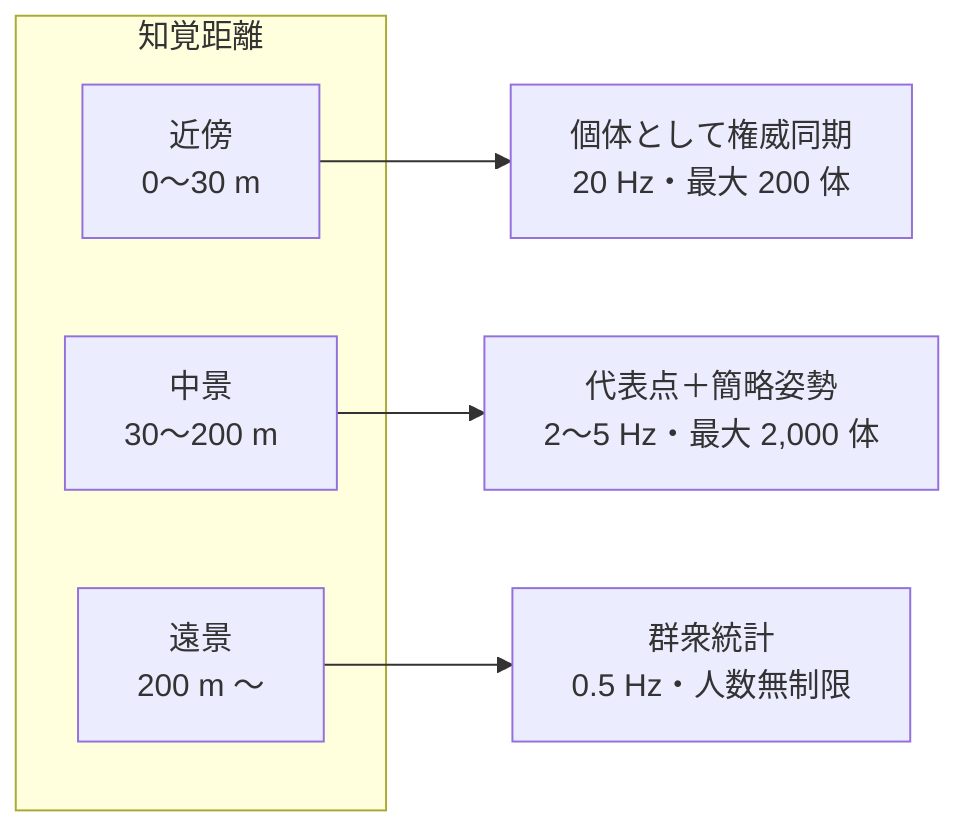
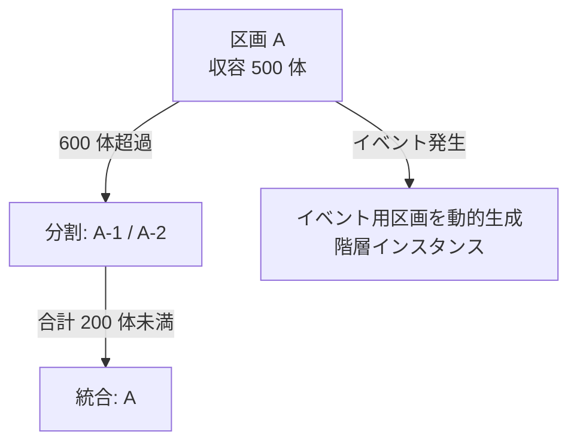
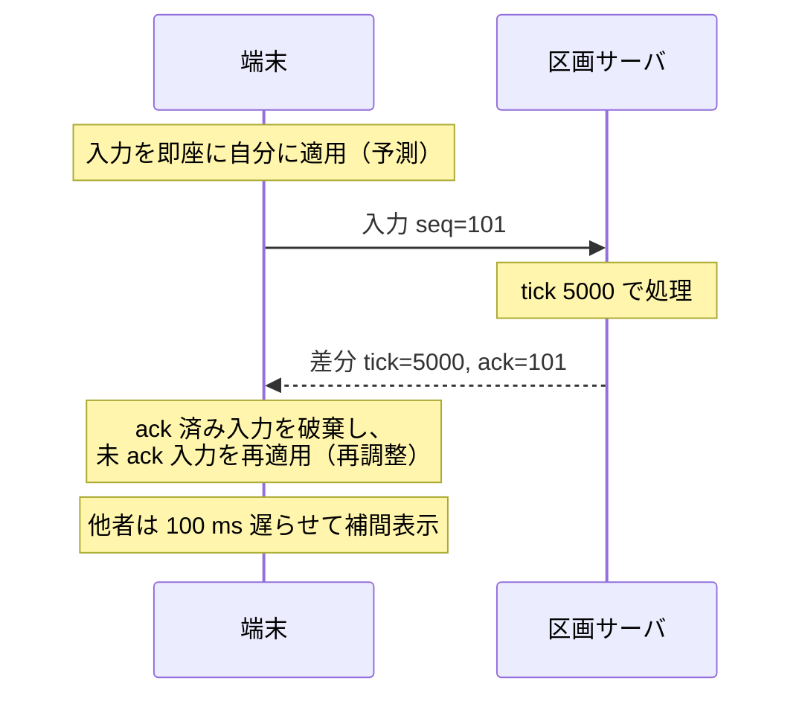
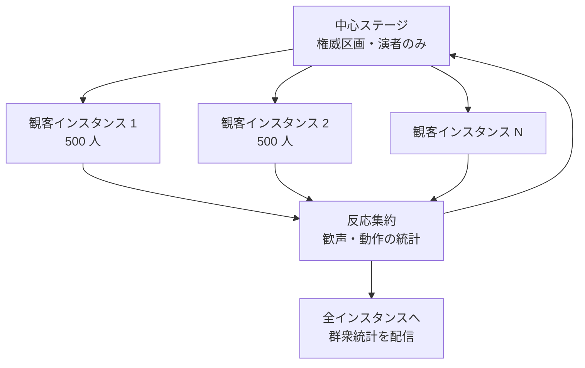

# 04. 空間シミュレーション

「全世界が同じ空間にいる」という体験を、有限の計算資源で成立させるための設計です。
結論から言えば、**全員を同じ精度で同期することは諦め、
人間が違いを知覚できる範囲にだけ精度を割り当てます**。

---

## 1. 精度の三段階

| 段階 | 同期内容 | 更新頻度 | 上限 | 誤差の見え方 |
| --- | --- | --- | --- | --- |
| 近傍 | 位置・姿勢・表情・発話・所持品 | 20 Hz | 200 体 | 知覚できない |
| 中景 | 位置・向き・移動状態・色 | 2〜5 Hz | 2,000 体 | 遠くの人の細かい仕草が曖昧 |
| 遠景 | 密度場・流向場・平均色・発話量 | 0.5 Hz | 無制限 | 個体は識別できないが「大勢いる」ことは正確 |

遠景は個々のアバターを送らず、**格子状の統計量**として送ります。
100 万人の群衆は、256×256 の密度格子（約 400 KB、圧縮後 20 KB 程度）で表現でき、
端末側はこの場に基づいて群衆を手続き的に生成します。
生成された個体は本物のアバターではありませんが、
人数・流れ・混雑の変化は実データに従うため、空間の実感は保たれます。

近づくと中景・近傍へ昇格し、そこで初めて本人のアバターに置き換わります。
この遷移は 1〜2 秒かけて行い、瞬間的な入れ替わりを見せません。

---

## 2. 区画分割

### 2.1 分割方式

固定のグリッドではなく、**密度に応じた適応的分割**を採る。

| パラメータ | 値 | 備考 |
| --- | --- | --- |
| 分割しきい値 | 権威アバター 600 体 | 15 秒継続で発動 |
| 統合しきい値 | 合計 200 体未満 | 60 秒継続で発動 |
| 分割所要時間 | 200 ms 以下 | 利用者には見えない |
| 境界の重なり幅 | 35 m | 近傍同期の距離を超える幅を確保 |

境界の重なり幅を近傍距離より広く取ることで、
区画をまたぐ相互作用が途切れません。境界上のアバターは
両方の区画サーバに複製され、権威は片方のみが持ちます。

### 2.2 引き継ぎ

利用者が区画をまたぐとき：

1. 移動先区画が、移動元から権威状態のスナップショットを受け取る。
2. 移動先が受理応答を返し、移動元が権威を放棄する。
3. 接続ゲートウェイの配送先を切り替える。
4. 端末には通知しない（見た目の連続性を保つ）。

引き継ぎ中の 2 tick 分は両区画が同じ入力を処理し、結果を突き合わせます。
不一致があれば移動元の結果を採用し、差分を記録します。

---

## 3. 状態同期

### 3.1 基本方式

サーバ権威 + 端末側予測 + 差分配信。

| 手法 | 適用先 | 目的 |
| --- | --- | --- |
| 端末側予測 | 自アバター | 入力の即時反映（体感 0 ms） |
| サーバ再調整 | 自アバター | 不正防止と最終的な整合 |
| 補間（100 ms 遅延） | 他アバター | 揺らぎの吸収 |
| 外挿（最大 250 ms） | 通信断時の他アバター | 停止よりは自然な継続 |
| 差分符号化 | 全体 | 帯域削減（前回送信状態との差） |
| 量子化 | 位置・回転 | 位置 1 cm 刻み、角度 0.006 rad 刻み |

### 3.2 不正防止

| 不正 | 検出 |
| --- | --- |
| 速度超過・瞬間移動 | サーバ側で移動量を毎 tick 検証。超過分は棄却 |
| 壁抜け | サーバ側の衝突判定が権威。端末の判定は表示用 |
| 入力の水増し | tick あたり 1 入力に正規化。超過は破棄 |
| 他者状態の偽装 | 他者状態は端末から受け取らない |
| 所持品の複製 | 授受は台帳の二相確定を必須とする |

---

## 4. 大規模イベント

数万〜数百万人が一点に集まる催事・競技観戦のための構成です。

- 観客は 500 人単位のインスタンスに分かれ、その中では個体として同期される。
- 隣のインスタンスの人々は群衆統計として見える。
- 歓声や拍手は集約され、**全体の反応として全員に返る**。
  自分の拍手が全体の音量に寄与するため、参加している実感は損なわれない。
- 演者側には、全インスタンスを合算した反応量のみが届く。

この構成では、100 万人の観客は 2,000 インスタンス、
必要な計算資源は線形にしか増えません。

---

## 5. 対戦ルーム

競技における公平性は、大規模空間の同期方式とは要件が異なります。
遅延の非対称が勝敗を決めてはならないため、別系統を用意します。

| 項目 | 大規模空間 | 対戦ルーム |
| --- | --- | --- |
| 同期方式 | サーバ権威＋予測 | 決定論的シミュレーション＋ロールバック |
| tick | 20 Hz | 60 Hz |
| 参加者 | 最大 500 | 2〜16 |
| 遅延補正 | 補間 100 ms | ロールバック 最大 8 フレーム |
| 検証 | サーバが権威 | 全参加者の結果ハッシュを突合 |
| 配置 | 地域クラスタ | 参加者の中間地点に近いエッジ |

**賭けの対象にできるもの・できないもの**

| 対象 | 可否 | 理由 |
| --- | --- | --- |
| 空間内アイテム、称号、通貨 | 可 | 台帳上の移転として処理できる |
| アカウントそのもの | **不可** | 同一性は移転できてはならない |
| 資格情報・権限 | **不可** | 権限の移転は認可の破壊にあたる |
| 現実資産への請求権 | 要規制対応 | 分野ごとに法令に従う |

原作では対戦の賭け金がアカウントそのものでしたが、
これは「勝てば他人になれる」ことを意味し、認証の前提が崩れます。
本設計では、同一性は競技の結果によって移動しません。

---

## 6. 障害時のふるまい

| 障害 | ふるまい | 利用者の体験 |
| --- | --- | --- |
| 区画サーバ 1 プロセス停止 | 直近チェックポイント（2 秒間隔）から隣接ノードで再開 | 2 秒巻き戻り、接続は維持 |
| 地域クラスタ全停止 | 別地域の玄関区画へ再入場 | 再入場が必要、資産は無傷 |
| 経済台帳の応答不能 | 授受と決済を停止、移動と会話は継続 | 「取引は一時停止中」と表示 |
| ID サービスの応答不能 | 既存セッションは継続、新規入場を停止 | 中の人は気づかない |
| 群衆合成器の停止 | 遠景の群衆が消え、近傍のみ描画 | 空間が閑散として見える |

**どの障害でも、資産・同一性・記録は影響を受けません。**
空間側の縮退が、この三つに波及しないことが設計の受け入れ条件です。
