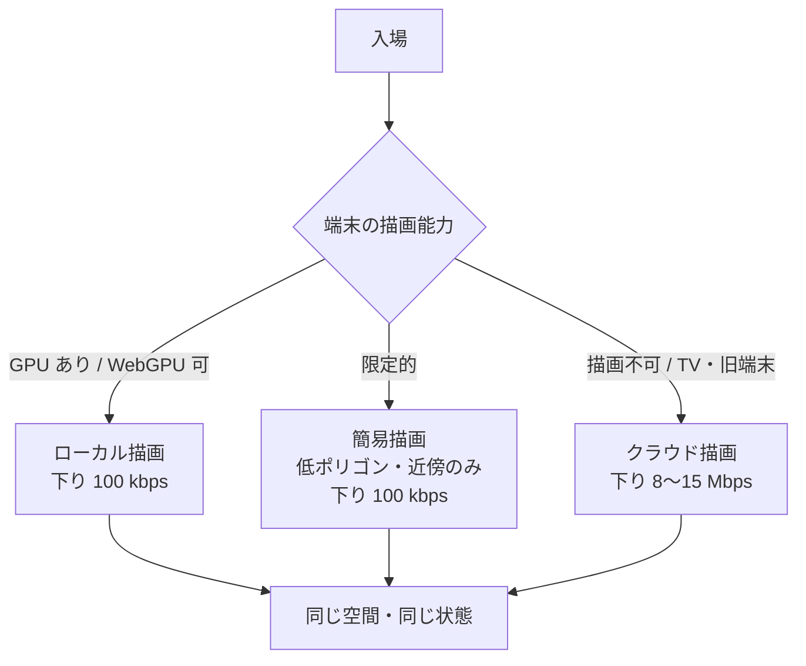
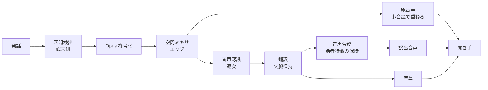

# 05. ネットワークとクライアント

「携帯電話からでもテレビからでも、同じ世界に同じように入れる」という要件を、
端末の性能差と回線の品質差を吸収する形で実現します。

---

## 1. 転送プロトコル

| 用途 | プロトコル | 理由 |
| --- | --- | --- |
| 状態同期 | QUIC datagram（WebTransport） | 順序保証なしで低遅延。古い状態は再送不要 |
| 重要イベント | QUIC stream | 授受・入退場など、失われてはならないもの |
| 音声 | QUIC datagram（Opus） | 遅延優先。損失は補間 |
| 映像配信（催事） | 低遅延 HLS / WebRTC | 視聴専用の経路 |
| クラウド描画 | WebRTC（H.265 / AV1） | 端末側のデコーダ対応に合わせる |
| アセット取得 | HTTP/3 + CDN | 大きく、共有され、変化しない |

UDP が塞がれている環境向けに TCP / HTTPS フォールバックを用意しますが、
遅延は 2〜3 倍に悪化するため、その旨を利用者に表示します。

### 1.1 遅延予算（同一地域・標準経路）

| 区間 | 予算 |
| --- | --- |
| 入力取得〜送出 | 8 ms |
| 端末 → エッジ | 15 ms |
| エッジ → 区画サーバ | 12 ms |
| サーバ処理（1 tick） | 50 ms（20 Hz） |
| 区画サーバ → エッジ | 12 ms |
| エッジ → 端末 | 15 ms |
| 受信〜描画 | 16 ms |
| **合計（他者への反映）** | **約 128 ms** |

自分の動きは端末側予測により即時反映されるため、
利用者が体感する遅延は描画 1 フレーム分です。

### 1.2 帯域適応

| 実効帯域 | 近傍同期数 | 更新頻度 | 群衆 | 音声 |
| --- | --- | --- | --- | --- |
| 2 Mbps 以上 | 200 | 20 Hz | 高精細 | 48 kbps |
| 500 kbps | 120 | 20 Hz | 標準 | 32 kbps |
| 200 kbps | 60 | 15 Hz | 簡略 | 24 kbps |
| 80 kbps | 24 | 10 Hz | 密度のみ | 16 kbps |
| 40 kbps | 8 | 5 Hz | なし | 16 kbps |

品質を落とす順序は固定します。**音声が最後まで残る**。
会話が成立しなくなった時点で、その空間にいる意味が失われるためです。

---

## 2. 描画方式

| 方式 | 対象端末 | 下り帯域 | サーバ負荷 | 追加遅延 |
| --- | --- | --- | --- | --- |
| ローカル描画 | スマートフォン、PC、据置ゲーム機 | 100 kbps | なし | 0 |
| 簡易描画 | 携帯ゲーム機、廉価端末 | 100 kbps | なし | 0 |
| クラウド描画 | テレビ、旧世代端末、ブラウザのみの環境 | 8〜15 Mbps | GPU 1/8 台 | 30〜45 ms |

クラウド描画は費用が桁違いに高いため、全セッションの 5% を上限とし、
超過時は簡易描画へ誘導します。混雑時は**有料枠を優先しない**ことを運用規約に明記します。

---

## 3. アバターとアセット

| 項目 | 採用仕様 | 理由 |
| --- | --- | --- |
| アバター形式 | VRM（glTF 2.0 拡張） | 公開仕様、表情・視線・一人称視点の定義を含む |
| シーン・大規模空間 | OpenUSD | 大規模シーンの合成・差分編集に向く |
| テクスチャ圧縮 | KTX2 / Basis Universal | 端末ごとの再変換が不要 |
| アニメーション | glTF アニメーション＋手続き生成 | 群衆の手続き生成に必要 |
| 配信 | コンテンツアドレス指定（ハッシュ） + CDN | 重複排除と改ざん検知 |

### 3.1 LOD 構成

| 段階 | 頂点数 | ボーン | 適用距離 |
| --- | --- | --- | --- |
| LOD0 | 30,000 | 全身 + 表情 | 0〜8 m |
| LOD1 | 8,000 | 全身 | 8〜30 m |
| LOD2 | 1,500 | 簡略 | 30〜80 m |
| LOD3 | 300 | なし（ビルボード） | 80〜200 m |
| 群衆 | インスタンス描画 | なし | 200 m 〜 |

アバターのアップロード時に全 LOD を自動生成し、
利用者が高負荷なモデルを持ち込んでも他者の描画負荷が上がらないようにします。

### 3.2 持ち運び（相互運用）

アバターと所持品は、**OZ の外に持ち出せる**ことを要件とします。

- VRM / glTF で書き出し、他のプラットフォームで読み込める。
- 所有証明は検証可能な資格情報として発行し、OZ の台帳が停止しても証明が残る。
- 事業者固有の拡張は必ず任意扱いとし、なくても最低限表示できる形を保つ。

囲い込みを避けることは理念上の要請であると同時に、
単一事業者障害時に世界が消えないための技術要件でもあります。

---

## 4. 音声と翻訳

### 4.1 遅延内訳（発話終端から訳出開始まで）

| 工程 | 予算 |
| --- | --- |
| 区間検出の確定 | 180 ms |
| 音声認識（逐次・末尾確定） | 300 ms |
| 翻訳（文脈付き） | 250 ms |
| 音声合成（先頭チャンク） | 200 ms |
| 伝送 | 120 ms |
| **合計** | **約 1,050 ms** |

逐次処理により、**発話の途中から訳出を始める**ことで体感遅延を下げます。
確定前の訳は字幕に薄く表示し、確定後に置き換えます。

### 4.2 設計上の注意

- **原音声を消さない。** 訳出音声の背後に原音声を小音量で重ねる。
  声色や感情、笑いは翻訳を経ると失われるためです。
- **誤訳を可視化する。** 確信度の低い箇所は字幕上で明示し、原文を参照できるようにする。
- **翻訳しない選択を許す。** 同じ言語の話者同士、あるいは意図的に原語で聞きたい場面がある。
- **重要な場面では自動翻訳のみに依存させない。** 行政・医療・金融の窓口では、
  翻訳結果に基づく確定操作の前に、原文と訳文の両方を提示して確認を求める。

---

## 5. 端末別の対応方針

| 端末 | 描画 | 入力 | 制約と対応 |
| --- | --- | --- | --- |
| スマートフォン | ローカル（WebGPU / ネイティブ） | タッチ、音声、カメラ表情 | 発熱制御のため 30 fps 上限を既定に |
| PC | ローカル | キーボード、マウス、カメラ | 最も自由度が高い |
| 据置ゲーム機 | ローカル | コントローラ | 認証は端末のセキュア領域を利用 |
| 携帯ゲーム機 | 簡易描画 | コントローラ | 近傍 60 体、群衆は密度のみ |
| テレビ | クラウド描画 | リモコン、音声 | 操作系を大幅に簡略化した専用 UI |
| ブラウザのみ | ローカルまたはクラウド | 環境依存 | インストール不要の入場経路として重要 |

**どの端末からでも同じ世界の同じ状態に入れる**ことが要件であり、
見た目の忠実度が違うことは許容します。逆は許容しません。
たとえば「携帯ゲーム機からは会話に参加できない」は不可です。

---

## 6. アクセシビリティ

- 字幕は既定で有効。話者の位置を字幕の表示位置と色で示す。
- 音声を出せない利用者のために、テキスト入力が音声合成で発話される経路を用意する。
- 動きによる不快感を避けるため、瞬間移動、視野固定、揺れ低減を既定で選択可能にする。
- 色覚特性に依存しない情報設計（色だけで意味を表さない）。
- 空間音響を用いた方向提示、および画面読み上げへの対応。
