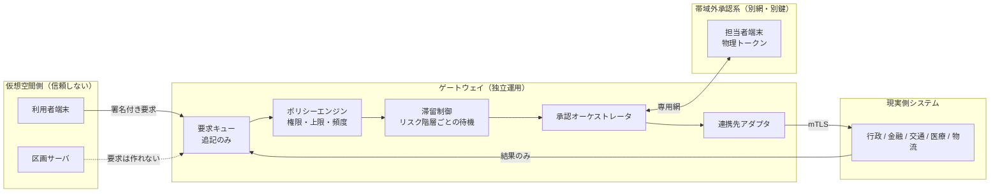
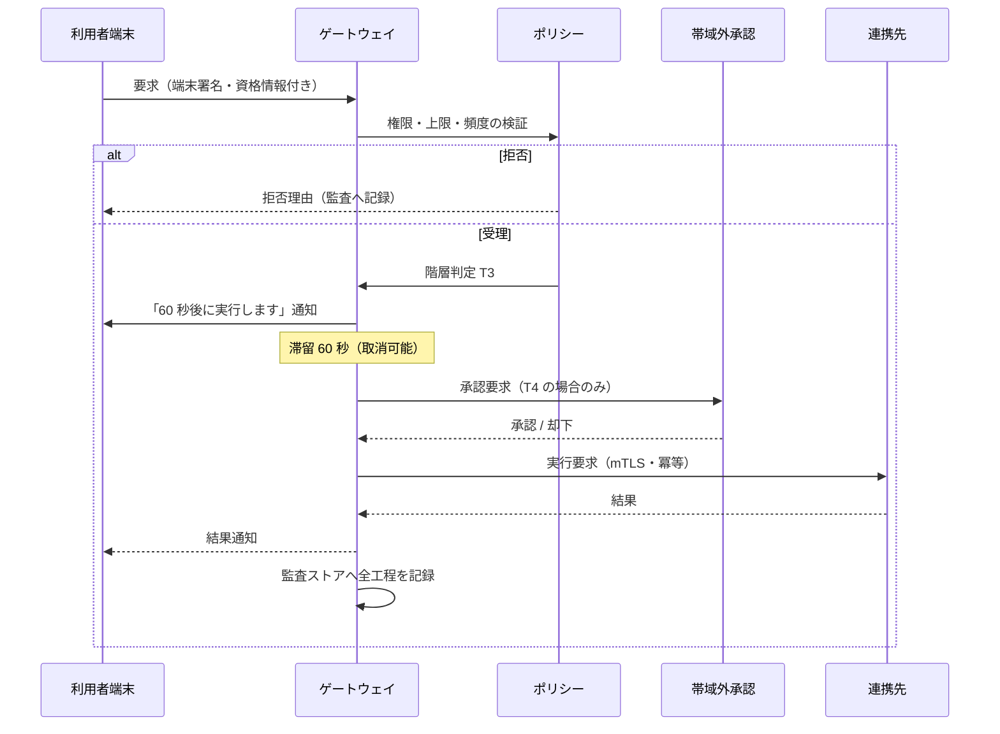

# 06. 現実世界ゲートウェイ

仮想空間と現実の業務システムを結ぶ層です。
本設計で最も慎重に扱う部分であり、**仮想空間側が現実を直接動かせない**という
一点を構造として保証します。

---

## 1. 基本構造

点線は「経路が存在しない」ことを示します。
区画サーバは要求を生成できません。要求は必ず利用者端末の署名を持ちます。
区画サーバが全面的に侵害されても、現実側への要求は 1 件も発生しません。

---

## 2. リスク階層

すべての要求は 4 段階のいずれかに分類されます。分類は連携先が定義し、
ゲートウェイ側が再検証します。仮想空間側の申告は採用しません。

| 階層 | 例 | 必要保証レベル | 最低滞留時間 | 承認 | 取消可能時間 |
| --- | --- | --- | --- | --- | --- |
| T1 閲覧 | 残高照会、運行情報、申請状況 | AL1 | なし | 不要 | — |
| T2 可逆 | 座席予約、配送の受取変更、少額決済 | AL2 | なし | 不要（事後通知） | 30 分 |
| T3 重要 | 証明書交付、高額決済、契約締結 | AL3 | 60 秒 | 自動＋利用者の再確認 | 24 時間 |
| T4 重大 | 公的記録の更新、大口資金移動、医療上の決定 | AL4 | 10 分 | **人手による帯域外承認** | 個別規定 |
| — 制御 | インフラ制御、信号、弁、配電 | — | — | **経路そのものを設けない** | — |

### 2.1 滞留時間の意味

T3 以上には最低滞留時間を設けます。
即時に処理しないことで、次の三つが可能になります。

1. 利用者が誤操作に気づいて取り消せる。
2. 異常検知が「大量の同種要求」を検出して遮断できる。
3. 攻撃者が短時間に大量の実害を出せない。

作中で被害が拡大した最大の要因は速度でした。
**速度を落とすことが、この層における主要な防御機構**です。

### 2.2 帯域外承認

T4 の承認は、OZ とは独立した経路で行います。

| 項目 | 仕様 |
| --- | --- |
| 認証 | OZ ID を使わない。担当者の物理トークン（FIDO2 セキュリティキー） |
| ネットワーク | 専用線または独立した VPN。インターネット経由の管理画面を持たない |
| 表示 | 要求内容を、OZ 側が生成していないプレーンな形式で再表示する |
| 承認者 | 連携先の職員。OZ 運営者は承認できない |
| 記録 | 承認・却下の双方を監査ストアへ。理由の記載を必須とする |

「OZ 側が生成していない形式で再表示する」点が重要です。
表示内容まで OZ 側が作ると、侵害時に承認者を騙せてしまいます。

---

## 3. 連携先アダプタ

分野ごと・国ごとに独立したプロセスとして実装し、相互に影響しない構造にします。

| 設計項目 | 方針 |
| --- | --- |
| 分離 | 分野 × 国ごとに別プロセス・別資格情報・別ネットワーク区画 |
| 認証 | mTLS。証明書は連携先が発行し、OZ 側は秘密鍵を HSM に保管 |
| 冪等性 | すべての要求に一意な request_id を付し、再送を安全にする |
| 流量制限 | 連携先が定めた上限を、ゲートウェイ側でも独立に強制 |
| 遮断 | 連携先ごとに単独で閉じられる。1 名の判断で即時 |
| 監視 | 要求数、成功率、遅延、拒否理由の分布を連携先とも共有 |
| 障害時 | 連携先が応答しない場合、要求はキューに留まり、利用者に状況を表示 |

### 3.1 分野別の許可範囲

| 分野 | T1 | T2 | T3 | T4 | 備考 |
| --- | --- | --- | --- | --- | --- |
| 行政（証明書） | 申請状況 | — | 交付申請 | 記録更新 | 記録更新は窓口併用を必須 |
| 金融 | 残高・明細 | 少額決済 | 高額決済 | 大口移動 | 上限は利用者が自ら下げられる |
| 交通 | 運行情報 | 予約 | — | — | **制御系とは物理的に分離** |
| 医療 | 本人記録 | 予約 | 同意記録 | — | 診療上の決定は連携しない |
| 物流 | 配送状況 | 受取変更 | — | — | — |
| 電力・水道・通信 | 障害情報・使用量 | — | — | — | **書き込み要求を定義しない** |
| 教育 | 履修・成績閲覧 | 出欠連絡 | 履修登録 | — | — |

最下段に近い分野ほど、権限が閲覧に寄っています。
この配分は技術的制約ではなく意思決定の結果であり、
変更には [07 章](07-security-governance.md) §5 の手続を要します。

---

## 4. 要求のライフサイクル

利用者には、要求の状態が常に見えます。
「いつ・何を・誰に対して要求したか」「取り消せる残り時間」を一覧で提示し、
**身に覚えのない要求を本人が最初に発見できる**状態を作ります。

---

## 5. 全面侵害時の想定挙動

仮想空間側（端末、区画サーバ、プラットフォーム）が完全に攻撃者の制御下にあると仮定します。

| 攻撃者の試み | 結果 |
| --- | --- |
| 区画サーバから要求を生成 | 経路がなく、生成できない |
| 盗んだセッションで T1 要求 | 成功する（閲覧のみ、被害は情報漏えいに限定） |
| 盗んだセッションで T2 要求 | 端末鍵が必要。端末が物理的に攻撃者の手にない限り失敗 |
| 大量の T2 要求 | 流量制限と異常検知で数十秒以内に遮断 |
| T3 要求の大量投入 | 滞留中に検知され、一括で取り消される |
| T4 要求 | 帯域外承認が別系統のため通らない |
| インフラ制御 | 要求形式自体が存在しない |
| ゲートウェイの設定変更 | 別の権限系統。3 名承認が必要 |
| 監査ログの改ざん | 追記専用＋ハッシュ連鎖＋外部アンカリングで検出される |

想定される最大の被害は **情報漏えいと一時的なサービス停止** であり、
物理世界の機能は停止しません。これが本設計の到達点です。

---

## 6. 連携先が満たすべき条件

OZ 側の設計だけでは安全は成立しません。連携する事業者にも要件を課します。

1. OZ 経由の要求と、それ以外の経路からの要求を区別できること。
2. OZ 経由の要求に対して、独立した流量制限と上限を持つこと。
3. OZ からの接続を、事業者側の判断で単独遮断できること。
4. 遮断中も、自らの業務が継続できること（OZ への機能依存を持たないこと）。
5. 年 1 回以上、遮断訓練を実施すること。

4 番目が最も重要です。
**連携先が OZ なしでは業務を回せなくなった時点で、本設計の安全性は失われます。**
利便性の向上と引き換えにこの条件を緩める提案は、常に拒否します。
