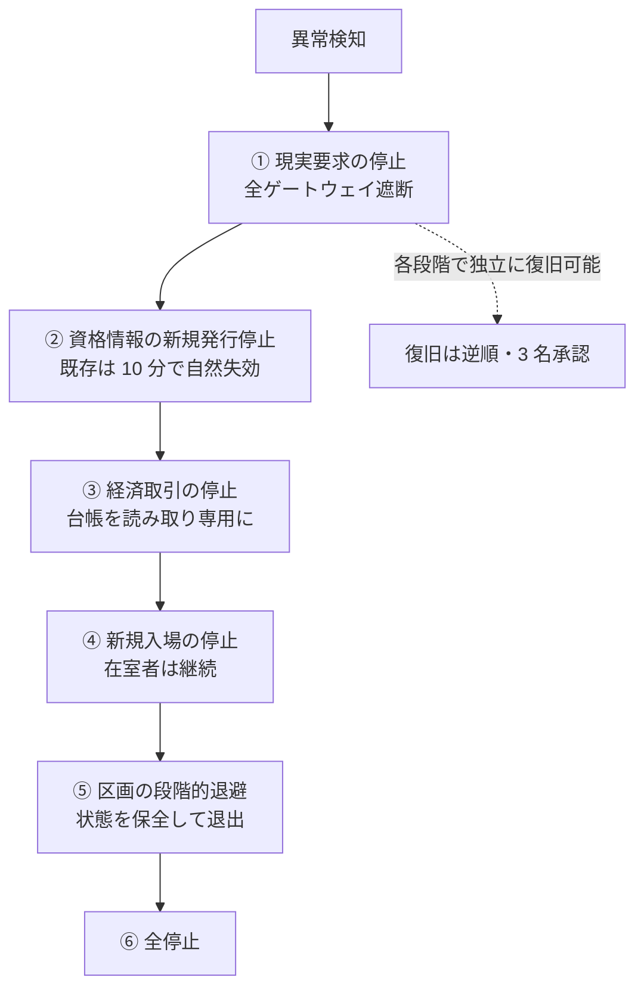

# 07. セキュリティと運用・ガバナンス

---

## 1. 脅威モデル

### 1.1 想定する攻撃者

| 分類 | 動機 | 能力 | 主な対策章 |
| --- | --- | --- | --- |
| 個人の不正利用者 | 優位、嫌がらせ | 端末 1 台、既製ツール | 04 §3.2、モデレーション |
| 詐欺グループ | 金銭 | 多数のアカウント、社会工学 | 03 §4、06 §2 |
| 内部関係者 | 金銭、報復 | 正規の特権 | 03 §5、監査の独立運用 |
| 国家支援の攻撃者 | 妨害、諜報 | ゼロデイ、供給網、長期潜伏 | 全章 |
| 自律的に拡散する攻撃 | — | 高速な自己複製、学習的挙動 | §2 |

### 1.2 自律拡散型攻撃（作中の事象に相当）

作中の被害は、次の四条件が揃ったことで成立しました。

| 条件 | 本設計での状況 |
| --- | --- |
| ① 認証を破れば何にでもなれた | **解消**。端末鍵は取り出せず、権限は用途別（03 章） |
| ② 権限が一枚岩で、奪えば全部使えた | **解消**。操作ごとに保証レベルを要求（03 §2.1） |
| ③ 仮想空間から現実インフラを直接操作できた | **解消**。経路を設けない（06 章） |
| ④ 止める判断と手段が遅かった | **軽減**。遮断は 1 名、自動遮断を併用（§3） |

四条件のうち三つを構造で潰し、残る一つを運用で軽減します。
単独の対策ではなく、いずれか一つが破られても残り三つが効く配置にしています。

### 1.3 攻撃面の一覧

| 攻撃面 | 主なリスク | 対策 |
| --- | --- | --- |
| 端末アプリ | 改造クライアント、メモリ改ざん | サーバ権威。端末の申告を信用しない |
| 接続ゲートウェイ | 資格情報の窃取、増幅攻撃 | 短命トークン、端末束縛、接続レート制限 |
| 区画サーバ | 不正な状態注入 | 権威は台帳に及ばない。侵害範囲を区画に閉じる |
| アセット配信 | 悪意あるモデルによる負荷攻撃、埋め込みコード | 取り込み時の検査、実行コードを含まない形式のみ許可 |
| 翻訳系 | 訳文への注入、誘導 | 訳出結果を操作として解釈しない。原文を常に保持 |
| 供給網 | 依存ライブラリ、ビルド環境 | 再現可能ビルド、成果物の署名、SBOM の維持 |
| 運用系 | 内部犯行、誤操作 | 特権の分割、二人以上の承認、監査の外部運用 |

---

## 2. 監査

| 項目 | 仕様 |
| --- | --- |
| 対象 | 認証、資格情報の発行と行使、特権操作、現実要求の全工程、モデレーション判断 |
| 形式 | 追記専用。各エントリは直前エントリのハッシュを含む |
| 外部固定 | 1 時間ごとにルートハッシュを複数の外部台帳へ公開 |
| 運用主体 | 仮想空間の運用組織とは別の組織 |
| 保持期間 | 7 年（法域により調整） |
| アクセス | 独立監査組織の鍵で復号。単独では復号できない（2/3 のしきい値） |
| 利用者の閲覧 | 自分に関わる記録は、いつでも本人が取得できる |

**運営者自身が過去を書き換えられない**ことが要件です。
これが成り立たない限り、事故時の説明は信用されません。

---

## 3. インシデント対応

### 3.1 深刻度と初動

| 深刻度 | 定義 | 初動 | 決定者 |
| --- | --- | --- | --- |
| SEV4 | 一部区画の不具合 | 区画の再起動 | 当直 1 名 |
| SEV3 | 地域規模の機能低下 | 機能単位の縮退 | 当直 + 責任者 |
| SEV2 | 資格情報の異常な発行、連携先での異常 | ゲートウェイ遮断、発行停止 | 当直 1 名（即時）→事後報告 |
| SEV1 | 大規模なアカウント侵害の兆候 | **全ゲートウェイ遮断、新規発行停止、既存セッション維持** | 当直 1 名（即時） |
| SEV0 | 統制不能 | 段階的停止手順（§3.2） | 責任者 + 外部監視者 |

SEV1 以上で最初に切るのは**現実側への経路**です。
仮想空間を止めるのはその後で構いません。
中で人が会話していることより、現実の業務が守られることを優先します。

### 3.2 段階的停止手順

各段階は独立して実行・復旧できます。
「全部止めるか、何もしないか」の二択にしないことが、この手順の目的です。

### 3.3 復旧の原則

| 原則 | 内容 |
| --- | --- |
| 逆順 | 停止と逆の順序で戻す。現実への経路は**最後**に開ける |
| 多人数承認 | 各段階の緩和には 3 名の承認を要する |
| 段階的開放 | 1% → 10% → 50% → 100% と流量を上げ、各段で 15 分以上観測する |
| 原因未特定での全面復旧禁止 | 原因が特定できない場合、現実への経路は閉じたままにする |
| 公表 | 事象・影響範囲・対応を、確定した順に公表する |

### 3.4 訓練

| 訓練 | 頻度 | 内容 |
| --- | --- | --- |
| 遮断訓練 | 四半期 | ゲートウェイを実際に閉じ、連携先の業務継続を確認 |
| 地域全損訓練 | 半期 | 1 地域を落として再入場性能を測る |
| 侵害想定演習 | 年 1 回 | 大規模アカウント侵害を仮定した机上と実機の複合演習 |
| 復旧手順の実施 | 半期 | §3.2 の全段階を本番に近い環境で通す |

訓練していない手順は、事故時に実行されません。
特に「現実側の業務が OZ なしで回るか」は、
連携先を巻き込んだ実地訓練でしか確認できません。

---

## 4. モデレーションと安全

| 対象 | 方針 |
| --- | --- |
| 嫌がらせ・つきまとい | 個人空間（既定 1.2 m）、遮断、報告。遮断は相互に即時反映 |
| 未成年の保護 | 年齢に応じた既定の制限。年齢確認は属性の選択的開示で行い、生年月日を事業者へ渡さない |
| 有害コンテンツ | 取り込み時検査 + 通報 + 人手審査。自動判定のみで恒久的制裁を課さない |
| 詐欺 | 取引の履歴表示、相手の在籍期間の表示、高額取引の滞留 |
| なりすまし | 表示名の一意性は保証せず、代わりに検証済み属性の提示で区別する |
| 制裁 | 段階的（警告 → 機能制限 → 一時停止 → 恒久）。すべて異議申立の経路を持つ |

判断の記録はすべて監査対象です。
**モデレーションは権力**であり、その行使も監査されなければなりません。

---

## 5. ガバナンス

### 5.1 権限配分の変更手続

「与えない権限」（[03 章](03-identity.md) §3.2、[06 章](06-real-world-gateway.md) §3.1）の変更は、
技術的な設定変更ではなく、次の手続を経なければ実施できません。

1. 変更提案の公開（影響範囲・想定される悪用・代替案を含む）
2. 30 日以上の意見募集
3. 独立監査組織による評価
4. 連携先および所管当局の同意
5. 段階的導入（対象地域を限定した試行を 90 日以上）
6. 試行結果の公表と最終決定

この手続を「重い」と感じる設計であることは意図的です。
利便性を理由にこの列を動かす圧力は必ず生じるため、
手続そのものを抵抗力として設計しています。

### 5.2 運用体制の分離

| 組織 | 責務 | 持ってはならない権限 |
| --- | --- | --- |
| 空間運用 | 区画・エッジ・描画の運用 | ゲートウェイ、監査、ID 発行 |
| ID 運用 | OZ ID の発行・失効 | 空間運用、ゲートウェイ |
| ゲートウェイ運用 | 連携先との接続 | ID 発行、空間運用 |
| 独立監査 | 監査ログの保全と検証 | 上記すべての運用権限 |
| 外部監視者 | SEV0 時の立会、年次報告の検証 | すべての運用権限 |

単一の人物・単一の組織が全体を掌握できない構造にします。
これは内部犯行対策であると同時に、**一組織の侵害が全体の侵害にならない**ための構造です。

### 5.3 説明責任

- 重大事象は、確定した事実から順に、48 時間以内に第一報を公表する。
- 年次で、要求件数・拒否件数・遮断回数・訓練実施状況・制裁件数を公表する。
- 監査ログのルートハッシュは常時公開し、第三者が整合性を検証できる状態に保つ。

---

## 6. 法令・越境

| 論点 | 方針 |
| --- | --- |
| データ所在 | 個人データは原則として利用者の居住地域内に保管し、必要最小限のみ越境させる |
| 越境する情報 | 空間状態（位置・姿勢）は匿名化した上で越境可。ID・資産・監査は越境させない |
| 適用法 | 連携先の要求は連携先の法域の法令に従う。空間内の行為は利用者の居住地法を基準とする |
| 開示請求 | 法的根拠のある請求のみに応じ、件数と概要を年次で公表する |
| 撤退時 | 事業終了時、利用者が資産とアバターを持ち出せる期間を 12 か月以上確保する |
