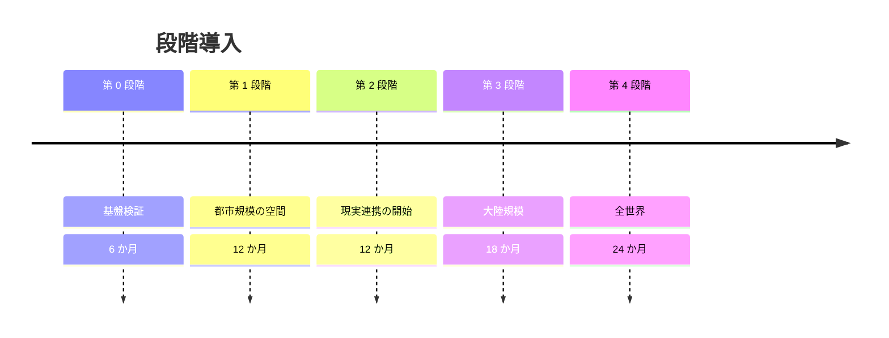

# 08. ロードマップ

一度に全部を作ることはできません。
各段階は**それ単体で価値のある製品**であり、次の段階の前提でもあります。
各段階の終わりに「次へ進まない」判断ができる形にしています。

---

## 1. 段階構成

### 第 0 段階：基盤検証（6 か月）

| 項目 | 内容 |
| --- | --- |
| 目標 | 同期方式と ID 方式が成立することの実証 |
| 規模 | 同時接続 1,000、単一地域 |
| 作るもの | 区画サーバ、端末予測、OZ ID（パスキー＋資格情報）、監査ストア |
| 作らないもの | 群衆合成、翻訳、クラウド描画、現実連携 |
| 通過条件 | 近傍 200 体・20 Hz で p95 遅延 150 ms 以下。ID の端末束縛が実機で成立 |
| 中止条件 | 遅延目標が 2 倍以上未達 |

### 第 1 段階：都市規模の空間（12 か月）

| 項目 | 内容 |
| --- | --- |
| 目標 | 人が集まって意味のある時間を過ごせる空間の成立 |
| 規模 | 同時接続 5 万、登録 100 万、見かけ 5,000 人 |
| 追加するもの | 群衆合成、区画の動的分割、経済台帳、対戦ルーム、翻訳（テキスト先行）、モデレーション |
| 通過条件 | 大規模イベント 5,000 人の開催成功。台帳の二重支払いゼロ |
| 中止条件 | モデレーションが機能せず、利用者の定着が起きない |

### 第 2 段階：現実連携の開始（12 か月）

| 項目 | 内容 |
| --- | --- |
| 目標 | 現実サービスとの接続を、安全側に倒したまま成立させる |
| 規模 | 同時接続 30 万、連携分野 3 つ（物流の閲覧、交通の予約、少額決済） |
| 追加するもの | リアルワールド・ゲートウェイ、帯域外承認、リスク階層、独立監査組織 |
| 通過条件 | 遮断訓練を連携先込みで完遂。T3 以上の誤実行ゼロ |
| 中止条件 | 連携先が OZ 停止時に業務継続できない。または監査の独立性が確保できない |

### 第 3 段階：大陸規模（18 か月）

| 項目 | 内容 |
| --- | --- |
| 目標 | 地理的分散と多言語の実用化 |
| 規模 | 同時接続 500 万、8 地域クラスタ、エッジ 20 拠点 |
| 追加するもの | 音声翻訳、クラウド描画、地域間の引き継ぎ、地域全損からの復旧 |
| 通過条件 | 地域全損訓練で 90 秒以内の再入場。音声翻訳 p50 1.5 s 以下 |
| 中止条件 | 越境データ規制への適合が設計と両立しない |

### 第 4 段階：全世界（24 か月）

| 項目 | 内容 |
| --- | --- |
| 目標 | 目標規模の達成と、標準の外部化 |
| 規模 | 同時接続 1 億、登録 10 億、見かけ 100 万人、連携 20 分野 |
| 追加するもの | エッジ 40 拠点、相互運用の外部公開、他事業者との連合 |
| 通過条件 | 仕様が外部実装によって相互接続可能であることの実証 |

---

## 2. 体制

| 領域 | 第 0 段階 | 第 2 段階 | 第 4 段階 |
| --- | --- | --- | --- |
| 空間・同期 | 12 | 45 | 120 |
| クライアント・描画 | 8 | 35 | 90 |
| ID・暗号 | 6 | 20 | 40 |
| ゲートウェイ・連携 | 0 | 25 | 70 |
| 基盤・SRE | 8 | 40 | 150 |
| 翻訳・音声 | 0 | 12 | 35 |
| 信頼と安全 | 2 | 30 | 200 |
| 監査（別組織） | 2 | 10 | 30 |
| **合計（人）** | **38** | **217** | **735** |

信頼と安全の人数が第 4 段階で最大になります。これは想定どおりです。
大規模な共有空間において、対人的な問題は技術ではなく人手で処理されます。

---

## 3. 概算費用（年額・第 4 段階）

| 項目 | 概算 |
| --- | --- |
| 計算（区画・群衆・翻訳、5 万台規模） | 900 億円 |
| クラウド描画 GPU（全体の 5%） | 600 億円 |
| 帯域・トランジット（ピーク 10 Tbps） | 400 億円 |
| 保存（監査 2 PB、アセット 20 PB） | 120 億円 |
| 人件費（735 名） | 180 億円 |
| 監査・外部検証・規制対応 | 60 億円 |
| **合計** | **約 2,260 億円 / 年** |

利用者 1 人あたり年間約 226 円（登録 10 億人）。
この水準を維持するには、クラウド描画の比率管理と群衆配信の効率が決定的です。
特にクラウド描画は、比率が 5% から 15% に増えるだけで総額が 25% 増えます。

---

## 4. リスク登録簿

| # | リスク | 影響 | 可能性 | 対策 | 残存 |
| --- | --- | --- | --- | --- | --- |
| K-01 | 権限の拡大圧力により「与えない権限」が侵食される | 極大 | 高 | ガバナンス手続（07 §5.1）、変更の公開義務 | 中 |
| K-02 | 連携先が OZ に業務を依存し、停止できなくなる | 極大 | 高 | 遮断訓練の義務化、依存度の年次評価 | 中 |
| K-03 | 大規模アカウント侵害 | 大 | 中 | 端末束縛鍵、速度検知、自動遮断 | 低 |
| K-04 | 内部犯行による監査の無効化 | 大 | 低 | 監査の別組織運用、外部アンカリング | 低 |
| K-05 | クラウド描画の需要超過による費用崩壊 | 大 | 中 | 比率上限、簡易描画への誘導 | 低 |
| K-06 | 群衆表現が「偽物」と受け取られ、体験価値が失われる | 中 | 中 | 遷移の自然さ、反応集約による参加実感 | 中 |
| K-07 | 翻訳品質が対人的な不信を生む | 中 | 高 | 原音声の保持、確信度の可視化、確定前の原文提示 | 中 |
| K-08 | 単一事業者への集中による systemic risk | 極大 | 中 | 標準の外部化、連合構成、撤退時の持ち出し保証 | 中 |
| K-09 | 越境規制により地域ごとに分断される | 中 | 高 | データ所在の地域内完結、越境は匿名化した空間状態のみ | 中 |
| K-10 | モデレーション人員の心理的負荷 | 大 | 高 | 曝露時間の上限、専門的支援、自動一次選別 | 中 |

**K-01 と K-02 が最上位**である点が本設計の性格を表しています。
技術的な破綻より、便利さを求める正当な圧力によって
安全側の設計がなし崩しに緩む経路のほうが、はるかに起こりやすい。
このリスクへの対策は技術ではなく、手続と公開性です。

---

## 5. 各段階の撤退判断

段階の終わりに、次を満たさない場合は次段階へ進みません。

| 判断項目 | 内容 |
| --- | --- |
| 遮断の実証 | 現実への経路を実際に閉じ、連携先の業務が継続したこと |
| 監査の独立 | 運用組織が過去のログを改変できないことを第三者が確認したこと |
| 復旧の実証 | 段階的停止手順を全段階通し、逆順で復旧できたこと |
| 権限の維持 | 「与えない権限」の列が、前段階から広がっていないこと |
| 人手の充足 | 信頼と安全の人員が、利用者増に先行して確保されていること |

最後の項目は特に守られにくいものです。
利用者は先に増え、対応人員は後から増やされるのが常であり、
その時間差の中で共有空間の質は決定的に損なわれます。
**人員の確保を規模拡大の前提条件に置く**ことを、計画上の制約として明記します。
