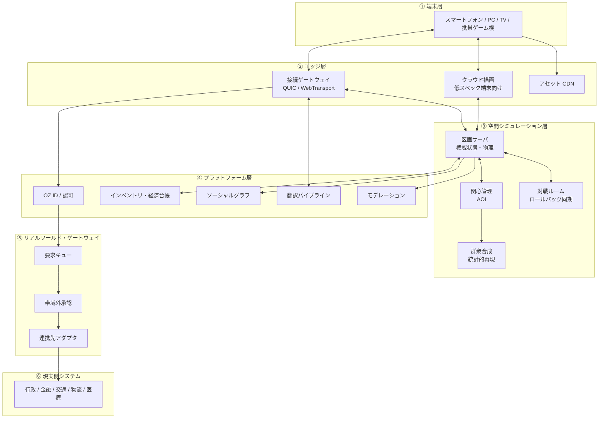

# OZ 構想 — 全世界がひとつにつながる仮想空間の設計図

細田守監督『サマーウォーズ』に登場する仮想空間 **OZ** を、現実の技術で実装するための
アーキテクチャ設計書です。空想の演出をそのまま再現するのではなく、
「作品が描いた体験」と「その体験が成立するために必要な仕組み」を要件に分解し、
2020 年代後半に調達可能な技術で構成できる形に落とし込みます。

本書は実装チーム、インフラ運用チーム、セキュリティ／ガバナンス担当、
および連携する行政・金融・交通事業者の技術窓口に向けた共通の参照資料です。

---

## 1. この設計が実現するもの

| 原作で描かれる体験 | 本設計での実現形 |
| --- | --- |
| ひとつのアカウントで世界中のサービスにつながる | 分散型 ID を核にした **OZ ID**。認証は集約し、権限は細分化する |
| 携帯・ゲーム機・テレビ・PC、どの端末からでも同じ世界に入れる | ローカル描画とクラウド描画を切り替える **二経路クライアント** |
| 数億のアバターが同じ空間に見える | 階層インスタンスと群衆 LOD による **見かけの一体空間** |
| 言語が違っても会話が成立する | 音声・テキストの **リアルタイム翻訳パイプライン** |
| 行政・インフラ・物流が OZ 上で動いている | 現実側を直接操作させない **リアルワールド・ゲートウェイ** |
| アカウントが乗っ取られ、現実が麻痺する | この事故を起こさないことを最優先の設計目標に置く |

最後の行が本設計の中心です。OZ の物語は「便利さを一点に集約した結果、
一点の破れが現実を止めた」という事故の記録でもあります。
したがって本書は、**つなぐ設計と同じ分量で、つながないための設計**を扱います。

---

## 2. 設計原則

1. **認証は一点に、権限は分散に。**
   ログインは OZ ID ひとつで済ませてよい。しかし「区役所の証明書を取る」権限と
   「上下水道の弁を操作する」権限が同じ鍵で開いてはならない。
2. **仮想空間は指示できるが、実行はできない。**
   物理インフラに対して OZ が出せるのは常に「要求」であり、
   実行は OZ の外にある独立した系が承認する。
3. **全体同期を諦める。**
   10 億人を単一の一貫した状態で同期することは物理的に不可能。
   ユーザーが知覚できる範囲だけを厳密に、それ以外は統計的に再現する。
4. **停止できることを機能とみなす。**
   区画単位・機能単位・連携先単位で切り離せる構造を先に作る。
   全断しかできない系は、全断するしかない事故を必ず起こす。
5. **標準で作り、囲い込まない。**
   アバター、アセット、ID、イベントはすべて公開仕様に基づく。
   単一事業者が止まっても世界が消えない構成を初期から取る。
6. **監査可能性を後付けしない。**
   すべての権限行使は、誰が・いつ・どの端末から・何を根拠に行ったかを
   改ざん検知可能な形で記録する。

---

## 3. 全体像

層をまたぐ呼び出しは一方向に制限します。特に ⑤ から ⑥ への経路は、
④ 以下のどのコンポーネントからも直接呼べません。

---

## 4. 目標規模

| 指標 | 初期 (第 1 段階) | 目標 (第 4 段階) |
| --- | --- | --- |
| 登録アカウント | 100 万 | 10 億 |
| ピーク同時接続 | 5 万 | 1 億 |
| 同一空間の見かけの同居人数 | 5,000 | 100 万 |
| 厳密同期される近傍人数 | 200 | 200 |
| 入力から自端末反映まで | 50 ms | 50 ms |
| 入力から相手端末反映まで（同一地域） | 120 ms | 100 ms |
| 音声翻訳の発話終端から再生まで | 2.5 s | 1.2 s |
| 連携する現実サービス | 3 分野 | 20 分野以上 |

「厳密同期される近傍人数」を規模拡大に対して据え置いている点が要です。
人間が同時に意味のある相互作用を持てる人数は増えないため、
ここを増やす設計は費用だけが増えて体験は良くなりません。

---

## 5. 文書構成

| 章 | 内容 |
| --- | --- |
| [01 要件定義](01-requirements.md) | 原作からの要件抽出、機能・非機能要件、規模の算定根拠 |
| [02 アーキテクチャ](02-architecture.md) | 層構成、主要コンポーネント、データフロー、主要 API |
| [03 アイデンティティ](03-identity.md) | OZ ID、認証、認可、アカウント保護と回復 |
| [04 空間シミュレーション](04-world-simulation.md) | 区画分割、状態同期、群衆表現、対戦ルーム |
| [05 ネットワークとクライアント](05-network-client.md) | 転送プロトコル、描画方式、端末対応、翻訳 |
| [06 現実世界ゲートウェイ](06-real-world-gateway.md) | 連携設計、承認フロー、遮断設計 |
| [07 セキュリティと運用](07-security-governance.md) | 脅威モデル、インシデント対応、モデレーション、ガバナンス |
| [08 ロードマップ](08-roadmap.md) | 段階導入計画、体制、概算費用、リスク登録簿 |

---

## 6. 本設計が明示的に扱わないもの

- 脳神経インターフェースなど、現行技術で調達できない入力手段
- 作中の演出をそのまま再現する視覚表現（美術仕様は別途）
- 各国の法制度への個別適合（07 章で枠組みのみ扱う）

---

## 7. 動く実装

本書の一部は、動かして確かめられる形にしてあります。

- [`oz/`](../../oz/) — 区画サーバとブラウザクライアントの最小実装。
  共有空間を歩き、群衆の中で人に会い、花札こいこいで対戦できます。
- 対応する章は 03（認証と認可の分離）、04（同期と関心管理、対戦ルーム）、
  05（遅延と帯域）です。実測値と、実装していない範囲は [`oz/README.md`](../../oz/README.md) に記載しています。
